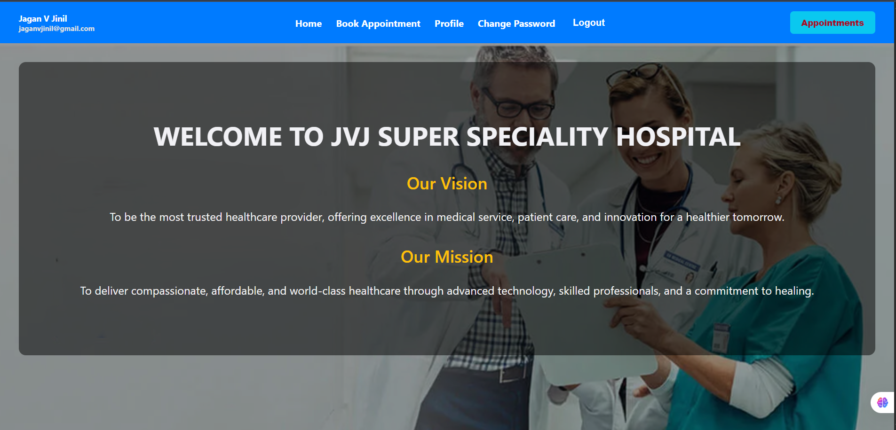

# 🏥 Hospital Appointment Booking - Frontend

This is the **React-based frontend** of the **Hospital Appointment Booking Website**. The application allows patients to register, view doctors, and book appointments. It communicates with a Django REST API backend.

---

## 🔥 Frontend Features

### 👤 Patient/User
- 📝 Sign Up / Login
- 👨‍⚕️ View Available Doctors
- 📅 Book Appointments (Date & Time)
- 🔍 Filter Doctors by Department
- 📋 View Upcoming & Past Appointments
- ❌ Cancel Appointments

---

### 🏠 Home Page

## 🚀 Tech Stack

| Layer     | Technology                    |
|-----------|-------------------------------|
| Frontend  | React, Axios, React Router    |
| Styling   | CSS, Tailwind CSS (optional)  |
| API Calls | Axios                         |
| Auth      | Token-based Authentication    |

---

## 🧠 Problem Solved

Many hospitals and clinics still use manual methods or inefficient tools for scheduling appointments, which leads to:
- ❌ Overlapping appointments
- 📞 Tedious manual booking
- 🕒 Time wasted by staff and patients

✅ **This system streamlines the booking process**, allowing users to:
- Book in real-time
- View doctor availability instantly
- Receive appointment confirmations on-screen

> If this system were used in a real hospital, it could **save 10–20 hours per week** in manual scheduling tasks and reduce no-shows by giving better visibility.

